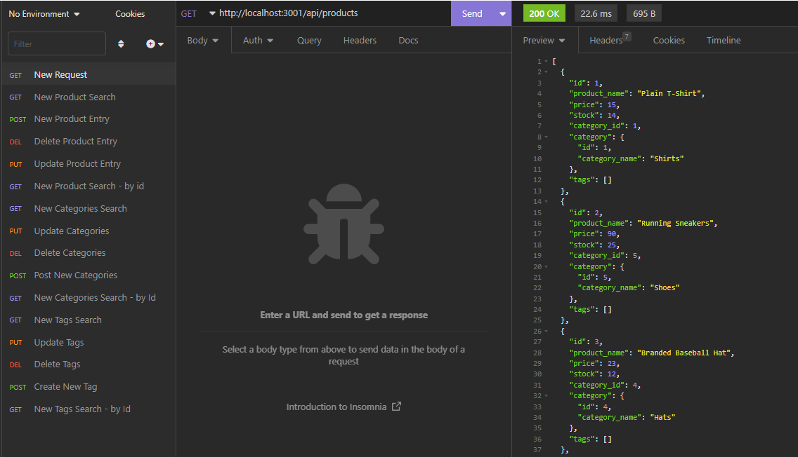
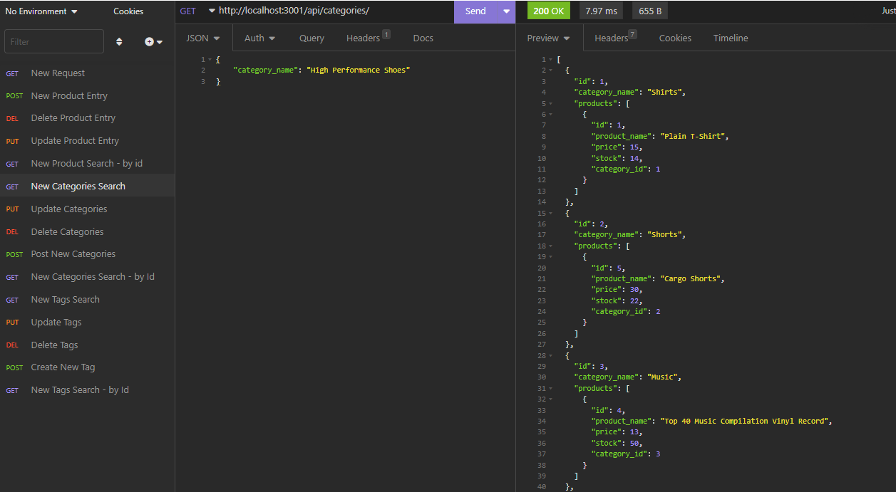
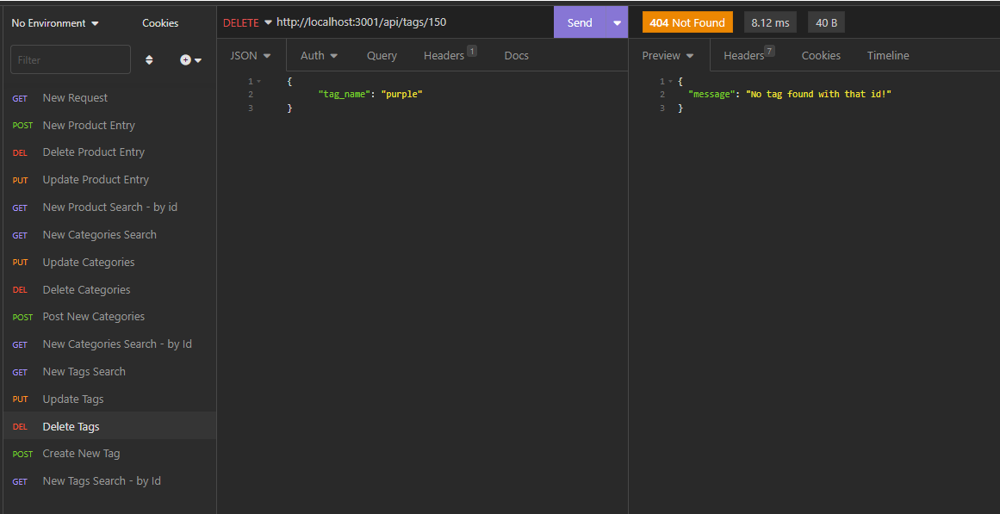

# 13 E-Commerce Back End 

   

  ## Description
 
This application was created help a business owner/manager with a internet retail company have a backend for their e-commerce website that uses the latest technologies so that their company can cmpete with other e-commerce companies. 

The application will be able to perform the following API routes: 
- GET routes to return all categories, all products and all tages
- GET routes to return a single category, a single product or a single tag
- POST (.create) routes to crete new categories, products & tags
- PUT (.update) routes to update individual categories, products & tags
- DELETE (.destroy) routes to remove individual categories, products & tags 

Things I've learned:

- How to use Sequalize, and how it relates to mySql, create models and various types of associates between the models 
- How to create CRUD operations (get, post, put, delete) in Sequalize 
- How to use the dotenv package to use environment variables to store sensitive data 
- Further testing experience with Insomnia 

 ## Table of Contents 
  - [Installation](#installation)
  - [Usage](#usage)
   - [License](#license)
   - [Contributing](#contributing)
   - [Test](#test)
   - [Questions](#questions)

  ## Installation

Please download the application via GitHub: 
- Run "npm install" to create the package-lock.json file 
- Using the mySQL shell, source the schema.sql file in the 'db' folder to create the database
- Seed the database in the terminal via node seeds/index.js
- Run the application via "npm start"

  ## Usage

A walkthrough video is available! 

The client can pick from many API functions for their e-commerce back-end, some examples include: 

Viewing all products the database contains: 

Viewing all categories the database contains:

Error message displayed if the client attempts to delete an invalid id:

A gif on how to use the application:  

  ## License

  Application is covered by the MIT License license 

  More information regarding said license can be found at https://choosealicense.com/licenses/mit
 

  ## Contributing 
  If you would like to contribute to this application, please reach out to me via one of the means listed under Questions.
  

  ## Test

Testing was done in Insomina

  ## Credits

Bootcamp buddy! Cassandra Watson https://github.com/cassiewatsonn  

  

## Questions
   Please contact me via one of the following methods: 
   
   * https://github.com/rkml14
   * rkmlawrence@gmail.com
